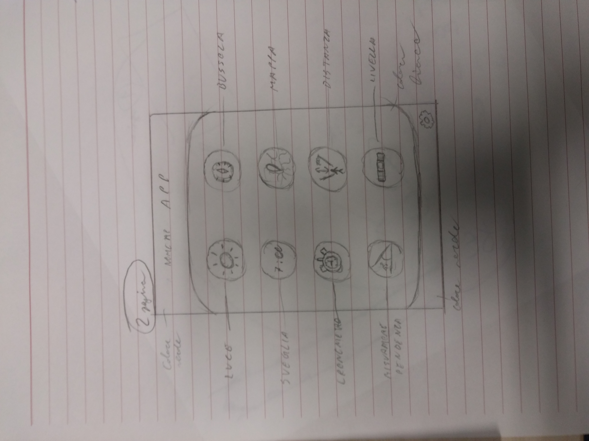
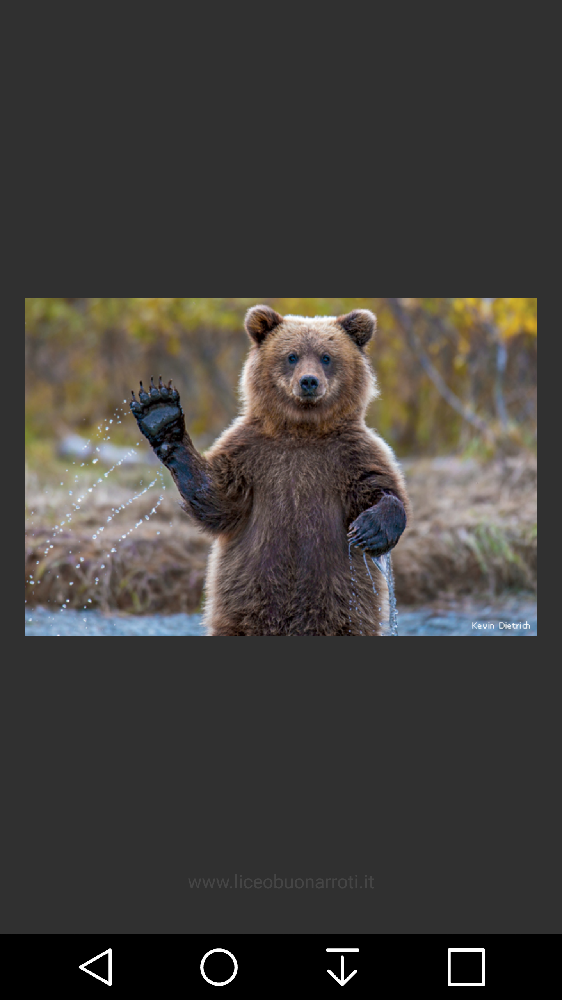
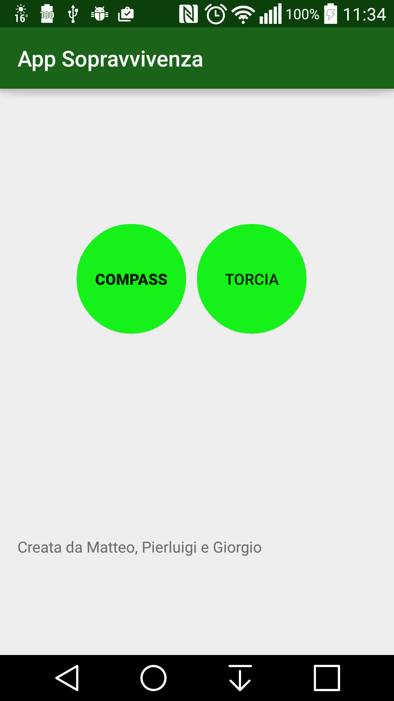

# AppSopravvivenza
App Sopravvivenza - Liceo Buonarroti tirocinio 3BSA 2016 Marzo

Tirocinio Formativo presso il Laboratorio FMT dell'Istituto ISTI del CNR di Pisa

Questo Repository contiene il codice dell'applicazione Android 
per la ‘sopravvivenza’

di seguito un esempio di mockup dell’applicazione:

di seguito 3 screenshot dell’applicazione ultimata:

